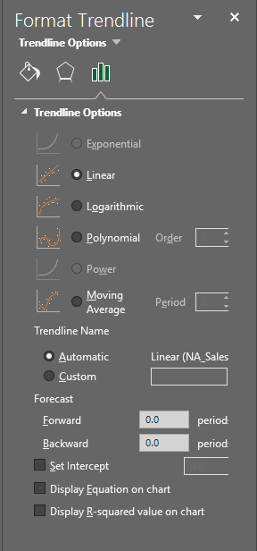
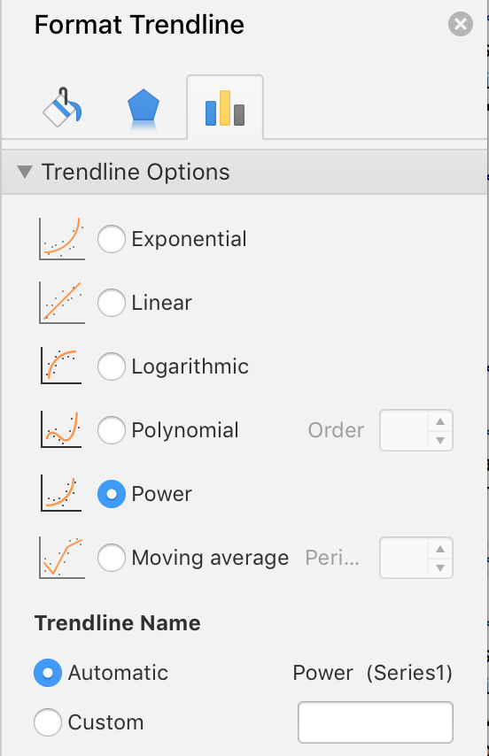
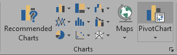
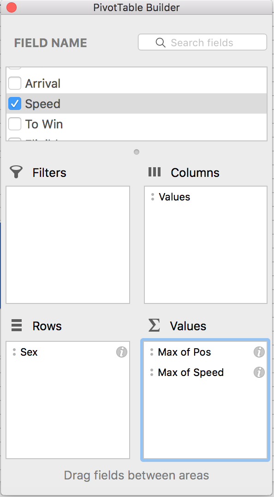
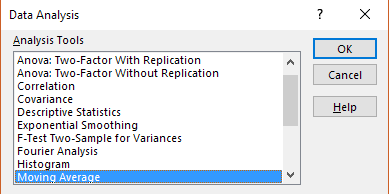
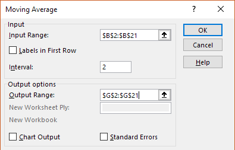
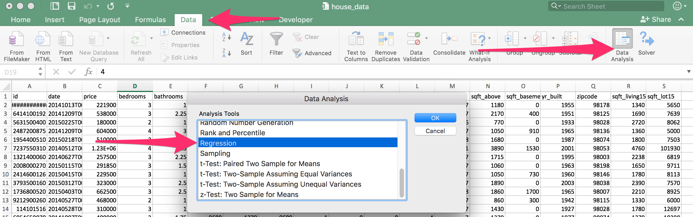
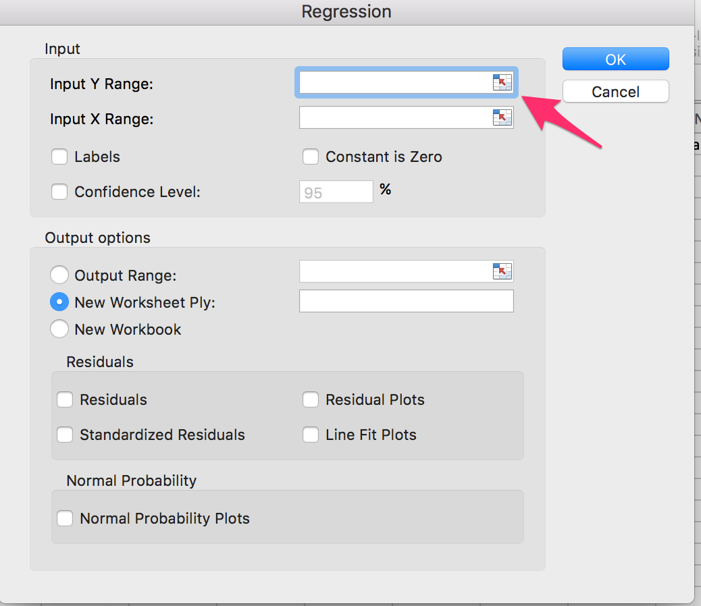
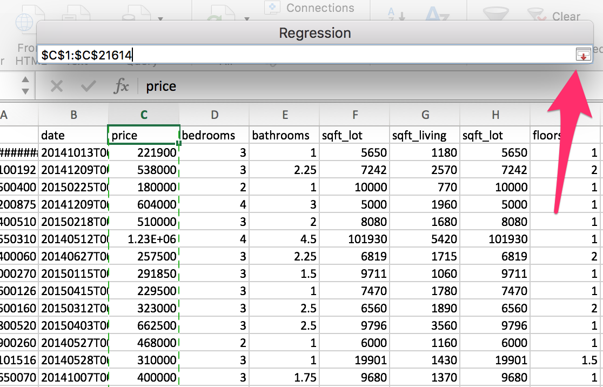
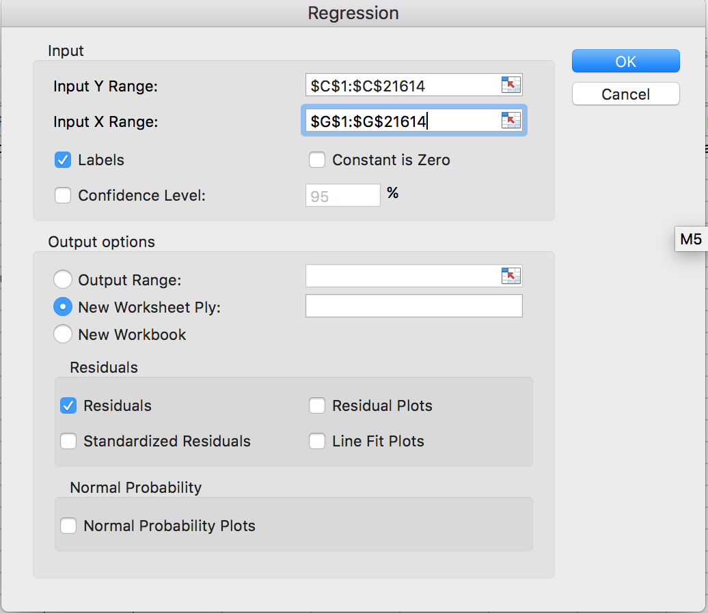

# Week 1
## Objectives
* Gain perspective on the course structure and general direction of the program.
* Gain exposure to the high-level analytic strategies and tools to be covered in class.
* Feel fully proficient in basic Excel navigation and functionality
* Gain familiarity with the value of Pivot Tables and the steps for their utilization.
* Gain comfort utilizing VLookups and HLookups
* Understand how to implement conditional formatting based on logical rules
* Be able to make, modify, and style bar charts, line graphs, pie graphs, and scatter plots.
* Understand how to filter data using Excel.
* Know how to calculate moving averages and regressions.
* Create, modify, and stylize basic charts from scratch using Microsoft Excel.
* Be comfortable creating scatter plots and trend lines.
* Have a firm understanding of how to create charts that contain filtered data.
* Know how to create regressions and calculate moving averages using Excel.

## Lession 1: Zen of Data
* Gain an understanding of the course structure and general direction of the program.
* Be exposed to high-level analytic strategies and tools.
* Introduction and icebreaker activities.  
**BE PREPARED**  

### Additional Resources: Lesson 1
[Storytelling With Data](http://www.storytellingwithdata.com/)  
[Excel Data Analysis](https://www.wiley.com/WileyCDA/WileyTitle/productCd-1118517148,miniSiteCd-BSG.html)  
[Advanced Excel Essentials](https://www.apress.com/us/book/9781484207352)   

* __01-Ins_GreatDebate__  
    * Data Science 
        * In the end is all about `Storytelling` and `Truth-Telling`
    * Where to start with any problem?
        * Decompose the Ask
            * Business Issue Understanding 
            * Break down the "ask"
        * Identify Data Sources
            * Look for quantitative proxy
            * Figure out potential data sources
        * Define Strategy and Metrics
            * Data Understanding
        * Build Data Retreival Plan
            * Determine means to retrieve data
        * Retrieve the Data
        * Assemble and Clean
            * Data Preparation
        * Analyze for Trends
            * Analyze data for obvious trends and look for statistical significance - Analysis/Modeling
        * Acknowledge Limitations
            * Assess what's missing in the current analysis
            * Validation
        * Make the Call or Tell the Story
            * Determine the best visual form to report the data
            * Presentation / Visualization
            * **PREPARE THE REPORT** 
        * Don't forget to mention `Lessons Learned`, `Future Features` would like to add to analysis, and `Possible Optimization` where it can occur!
* __02-Stu_Predict_Gentrification__ 
    * Wash, rinse and repeat with "Where to start with any problem?"

## Lession 2: Egad It's Excel!
* Fully proficient in basic Excel navigation and functionality
* Gain familiarity with the value of Pivot Tables and the steps for their utilization.
* Gain comfort utilizing VLookups and HLookups
* Understand how to implement conditional formatting based on logical rules

### Additional Resources: Lesson 2
[Excel Training and Tutorials](https://www.lynda.com/Excel-training-tutorials/192-0.html)  
[LP Optimization](https://en.m.wikipedia.org/wiki/Linear_programming)  
[LP Excel Tutorial](https://www.solver.com/solver-tutorial-using-solver)  
[LP Python Example 1](https://hackernoon.com/linear-programming-in-python-a-straight-forward-tutorial-a0d152618121)  
[LP Python Example 2](https://towardsdatascience.com/linear-programming-and-discrete-optimization-with-python-using-pulp-449f3c5f6e99)  
[Dynamic Named Ranges](https://www.excel-easy.com/examples/dynamic-named-range.html)  
[IF Function](https://support.office.com/en-us/article/IF-function-–-nested-formulas-and-avoiding-pitfalls-0b22ff44-f149-44ba-aeb5-4ef99da241c8)  
[Applying Borders to Cells in Excel](https://support.office.com/en-us/article/Apply-or-remove-cell-borders-on-a-worksheet-dc8a310b-92e3-46a7-9f17-2ab745810f4a)  
[Pivot Tables](https://support.office.com/en-us/article/create-a-pivottable-to-analyze-worksheet-data-a9a84538-bfe9-40a9-a8e9-f99134456576)  
[VLOOKUP Tutorial](https://www.excel-easy.com/examples/vlookup.html)  

* Additional Notes:  
**Make sure to check out Extra Content folder in GitLab for Session 2**  

    * Stu_Shipment: Using Excel Solver to create Simple Linear Programming (Optimization Model)
    * From Wikipedia: `Linear programming` (LP, also called linear optimization) is a method to achieve the best outcome (such as maximum profit or lowest cost) in a mathematical model whose requirements are represented by linear relationships.
* __01-Ins_ExcelPlayground__       **Basic Homework**
    * Basic data manipulation, functions and Excel Formula Builder (GUI)
        * Functions reviewed: Average(), Median(), Max(), Min(), STDEV.P(), and simple addition

* __02-Ins_NamedRanges__  
    * Named Ranges provide a more readable version of spreadsheet formulas.  To make a dynamic named range see link in additional resources
    
* __03-Ins_ColorCounter__           **Basic Homework**
    * Introduction to conditional formulas = Basic building block of coding (IF, AND, NOT, OR). Conditionals used to control flow of logic. 
    * Primary topics covered named ranges, conditional formating, condition formulas, and functions reviewed COUNTIF(),CHOOSE(),RANDBETWEEN(), IF(), AND(), NOT(), OR()

* __04-Stu_GradeBook__  
    * Opportunity to work with conditional formula.  Check out `IF Function` in additional resources.
    * Functions used IF(), AVERAGE(), ROUND(), IFS(), AND()

* __05-Ins_MultipleWorksheets__  
    * Topics covered: Adding worksheets in Excel, referencing other worksheets in formulas.

* __06-Stu_ApplesAndOranges__  
    * Practice referencing other worksheets in formulas.

* __07-Ins_Formatting__  
    * Topics covered: 
        * `Conditional Formatting` changes the the styling of a cell based upon whether or not some conditions are met. As such, this sheet includes rules which style cells based upon the values they contain.
        * `Numeric Formatting` style the numeric data of a spreadsheet so that it looks a certain way.

* __08-Stu_McDonaldsFormat__          **Basic Homework**  
    * Practice with conditional and numeric formatting

* __09-Ins_PivotTables__  
    * Topics covered: Creating pivot tables, understanding structure, filters, calculations.

* __10-Stu_TopSongsPivot__             **Basic Homework**  
    * Practice with Pivot Tables

* __11-Ins_Lookups__  
    * Lookup formulas work by:
        1) Selecting a range of data to browse through (generally a table)
        2) Selecting a value from within that range
        3) Selecting what corresponding information is desired
        4) Grabbing the result
    * `VLOOKUP()` function takes in four values: a lookup value, the range of a table, the index number for a column within that range and the match parameter. **Match Parameter** indicates either and Exact Match(`FALSE`) or an Approximate Match (`TRUE`)
    * `HLOOKUP()` function almost identical to `VLOOKUP()` except it searches through ranges horizontally instead of vertically

* __12-Stu_ProductPivot__               **Basic Homework**
    * Practice all you have learned :)

## Lession 3: Charting a New Course With Excel
* Be able to make, modify, and style bar charts, line graphs, pie graphs, and scatter plots.
* Understand how to filter data using Excel.
* How to calculate moving averages and regressions.

### Additional Resources: Lesson 3
[Choosing Right Chart](https://datavizcatalogue.com/search.html)  
[Moving Averages Finance](https://www.investopedia.com/ask/answers/122314/what-are-main-advantages-using-moving-averages-ma.asp)  
[Moving Average Excel Tutorial](https://www.excel-easy.com/examples/moving-average.html)  
[Linear Regression](https://www.statisticshowto.datasciencecentral.com/probability-and-statistics/regression-analysis/find-a-linear-regression-equation/)  

* __01-Ins_Git__
    * Links for Panopto videos:
        * [Class Videos](https://codingbootcamp.hosted.panopto.com/Panopto/Pages/Sessions/List.aspx#folderID=%22889181d5-3cf3-46c7-9eae-aa560151db63%22)
    * Link for Class Git Repository:
        * [Git Repository](https://smu.bootcampcontent.com/SMU-Coding-Bootcamp/SMU-DAL-DATA-PT-08-2019-U-C/tree/master)  
    * Link for setting up GitHub:
        *   
      
* __02-Ins_BasicCharting__  **Basic Homework** 
    * Basic bar charts.  Choosing bar from menu.  Able to add additional elements by selecting the `+` sign on right of chart.
* **PC**

  

* **Mac**

    
  * Manipulating Elements
* **PC**

  * Next, click on the plus sign to the right of our chart. This brings up a list of elements we can add/remove. Some of these elements have sub-elements which we can choose from as well.

    

  * Click on the "Axes Titles" option to add in titles for both our vertical and horizontal axes. Then click on the arrow to the right of the "Axes Titles" option to bring up the sub-menu, which allows us to choose the specific titles we would like to show.

  * By clicking on the paintbrush to the right of a chart, we can choose a number of basic visual styles from a list. We can also select a color scheme for our chart by selecting a palette from the Color group.

    

* **Mac**

  * Click on "Add Chart Element" on the left side of the ribbon and move down to "Axis Titles". Here, you can select Primary Horizontal or vertical.

    

  * Click on "Change Colors" on the ribbon to changes the colors of the bar graph (to the right of the "Add Chart Element").

  * Double click on any of the bars to bring up the "Format Data Series" menu. Here we can check the "Vary colors by point" option that will give each bar a different color.

      

    * On Macs, you can add a legend by clicking on "Add Chart Element" on the ribbon again, and select add "Legend" and the location.

      
    * **PC**: To filter the rows you'd like to show, choose the third option to the right of chart - this allows us to filter what categories of data we would like to show.

      * Select just a couple ice cream flavors from the list and then hit the "Apply" button to filter some data for our chart.

    * **Mac**: To filter what is shown on the chart, choose the `Home` tab, select column `A`, and click `Sort & Filter` in the right of the toolbar (may be hidden in the `Editing` tab at certain screen sizes). Once your column is in filter mode, click the arrow dropdown in its header cell: from there you will see options for sorting and filtering.

          
* __03-Stu_LineAndBar__  
    * Your turn to practice!
    
* __04-Ins_ScatterPlot__  **Homework** 
    * Scatter Plots are extremely helpful when checking for relationships between two variables. When adding a trend line to our chart it helps us see if there is a positive or negative relationship between our variables
* **PC**

  * Adding a trend line to a chart is very simple. Simply click on the plus symbol to the right of your selected chart and click the "trendline" option.

    

* **Mac**

  * Click "Add Chart Element" on the left side of the ribbon and move down to "Trendline" and select the one that best fits our data.

        
  
  * When want to change the type of trend line ie (Linear, Exponential, Linear Forecast, Moving Average, etc)
    * **PC**

      * In order to change the type of trend line that is being used, simply double-click on a chart's trend line and then select one of the options presented to you.

        

    * **Mac**

      * Click "Add Chart Element" on the left side of the ribbon and move down to "Trendline". This time select "More Trendline Options" to bring up the "Format Trendline" menu.

      * Check the "Power" option.

        
* __05-Par_GameSales__  
* __06-Evr_PigeonRacing__  
    * The need to filter.  How to quickly filter chart.
        * Select the first row of data on the sheet and then, in the Editing group of the Home tab, click on the "Sort & Filter" button. Next, select "Filter" from the menu that appears.
        * Arrows should appear at the top of each column. By clicking on these arrows, we can choose which rows we would like to filter out of our chart based upon the values that are contained within that column.
     * Pivot Charts
       * **PC**

    * Pivot charts operate in much the same way as pivot tables do, allowing users to aggregate data of similar types and then create visualizations for them.

    * To create a pivot chart, simply navigate into the Charts group of the Insert tab and select "Pivot Chart" from the options available. Once that is done, simply set up the pivot table you desire and a chart will be created based off of it.

      

  * **Mac**

    * We can also create what is called a Pivot Chart.

    * **NOTE:** There is an issue with some versions of Excel 2016 for Mac. If you find a student have this problem, make sure they update their Excel version: it works on updated versions.
    * First create a pivot table using Sex as our row values. "POS" and "Speed" as value.

    * Click the **!** next to them and switch to **Max** and this will create our pivot table.

    * The result should look as follows

      

    * Locate "Insert" on the ribbon add any recommended chart to create a Pivot Chart.

    * Now when you play around with the filters in our pivot table, the chart will adjust.
* __07-Par_FilterGameSales__  
* __08-Ins_MovingAverages__  
    *  "moving average" comes into play as it can be used to smooth out irregularities in data (large positive/negative spikes) to allow for easily recognizable trends.
    * In order to create moving averages, we first need to install a new add-in for Excel called the "Analysis ToolPak": go to the Tools menu and navigate to "Excel Add-Ins...". From the resulting window, select the "Analysis ToolPak".
      * Navigate into the Data tab, locate the Analyze group, and select the "Data Analysis" option. Macs just have a "Data Analysis" button.

  * From the menu that appears, select "Moving Average".

    

  * Click on the arrow beside "Input Range" and select the cells that you would like to average. In this case, select B2 to M2.
  * Set the interval you would like to take the average of.
  * The interval of a moving average is the number of data points that will take the average of.  This number includes the current data point.  The higher your interval the smoother your line will be
    

* __09-Stu_GolfingTargets__  
* __10-Ins_Regression__  
    * Linear Regression is relationship between a dependent variable and one or more explanatory or independent variables.
        
    * `Y Range` is our dependent variable or predictor variable
      * Click the box on the right side of the input box.

    

  * Click "price" then hit CMD+SHIFT+DOWN (CTRL+SHIFT+DOWN on Windows) to select the entire column and then hit the down arrow in the selection box.

    

  * `X range` is our independent variable or explanatory variables.
  
  * Select check the boxes next to `Labels` and `Residuals`.

    

   * _If you get an error about "Regression - Input range contains non-numeric data.", it means you forgot to check the "Labels" box! Alternately, you can alter your selected range to omit the header row._ 
    * `R Square` is how close data is to fitted line, the closer to `1.0` the better
    * `Significance F` and `P-values` let us tell how reliable the data is. Values under `0.05` are good, and anything higher means new independent variables should be selected.
* __11-Stu_NBAStats__ 

# Unit 1 Homework: Kickstart My Chart

## Background

Over $2 billion has been raised using the massively successful crowdfunding service, Kickstarter, but not every project has found success. Of the more than 300,000 projects launched on Kickstarter, only a third have made it through the funding process with a positive outcome.

Getting funded on Kickstarter requires meeting or exceeding the project's initial goal, so many organizations spend months looking through past projects in an attempt to discover some trick for finding success. For this week's homework, you will organize and analyze a database of 4,000 past projects in order to uncover any hidden trends.

## Instructions

Using the Excel table provided, modify and analyze the data of 4,000 past Kickstarter projects as you attempt to uncover some market trends.

* Use conditional formatting to fill each cell in the `state` column with a different color, depending on whether the associated campaign was successful, failed, or canceled, or is currently live.

  * Create a new column O called `Percent Funded` that uses a formula to uncover how much money a campaign made to reach its initial goal.

* Use conditional formatting to fill each cell in the `Percent Funded` column using a three-color scale. The scale should start at 0 and be a dark shade of red, transitioning to green at 100, and blue at 200.

  * Create a new column P called `Average Donation` that uses a formula to uncover how much each backer for the project paid on average.

  * Create two new columns, one called `Category` at Q and another called `Sub-Category` at R, which use formulas to split the `Category and Sub-Category` column into two parts.

  

  * Create a new sheet with a pivot table that will analyze your initial worksheet to count how many campaigns were successful, failed, canceled, or are currently live per **category**.

  * Create a stacked column pivot chart that can be filtered by country based on the table you have created.

  

  * Create a new sheet with a pivot table that will analyze your initial sheet to count how many campaigns were successful, failed, or canceled, or are currently live per **sub-category**.

  * Create a stacked column pivot chart that can be filtered by country and parent-category based on the table you have created.

* The dates stored within the `deadline` and `launched_at` columns use Unix timestamps. Fortunately for us, [there is a formula](https://www.extendoffice.com/documents/excel/2473-excel-timestamp-to-date.html) that can be used to convert these timestamps to a normal date.

  * Create a new column named `Date Created Conversion` that will use [this formula](https://www.extendoffice.com/documents/excel/2473-excel-timestamp-to-date.html) to convert the data contained within `launched_at` into Excel's date format.

  * Create a new column named `Date Ended Conversion` that will use [this formula](https://www.extendoffice.com/documents/excel/2473-excel-timestamp-to-date.html) to convert the data contained within `deadline` into Excel's date format.

  

  * Create a new sheet with a pivot table with a column of `state`, rows of `Date Created Conversion`, values based on the count of `state`, and filters based on `parent category` and `Years`.

  * Now create a pivot chart line graph that visualizes this new table.

* Create a report in Microsoft Word and answer the following questions.

1. Given the provided data, what are three conclusions we can draw about Kickstarter campaigns?
2. What are some limitations of this dataset?
3. What are some other possible tables and/or graphs that we could create?

## Bonus

* Create a new sheet with 8 columns:

  * `Goal`
  * `Number Successful`
  * `Number Failed`
  * `Number Canceled`
  * `Total Projects`
  * `Percentage Successful`
  * `Percentage Failed`
  * `Percentage Canceled`

* In the `Goal` column, create 12 rows with the following headers:

  * Less than 1000
  * 1000 to 4999
  * 5000 to 9999
  * 10000 to 14999
  * 15000 to 19999
  * 20000 to 24999
  * 25000 to 29999
  * 30000 to 34999
  * 35000 to 39999
  * 40000 to 44999
  * 45000 to 49999
  * Greater than or equal to 50000

  

* Using the `COUNTIFS()` formula, count how many successful, failed, and canceled projects were created with goals within the ranges listed above. Populate the `Number Successful`, `Number Failed`, and `Number Canceled` columns with this data.

* Add up each of the values in the `Number Successful`, `Number Failed`, and `Number Canceled` columns to populate the `Total Projects` column. Then, using a mathematical formula, find the percentage of projects that were successful, failed, or canceled per goal range.

* Create a line chart that graphs the relationship between a goal's amount and its chances at success, failure, or cancellation.

## Submission

* To submit your homework, upload the solution and files to a GitHub repo, Dropbox, or Google Drive and submit the link to <https://bootcampspot.com/>.

- - -

© 2019 Trilogy Education Services
